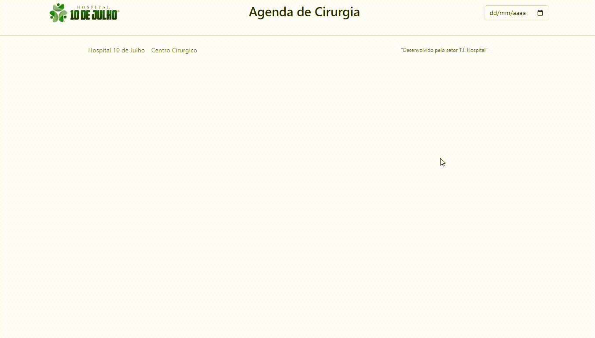

<div align="center">
  <h1 align="center">
    Agenda de Cirurgia
    <br />
    <br />
    
    <br />
  </h1>

  <h2> 
  
  :white_check_mark: Projeto finalizado
  </h2>
</div>


---

# :file_folder: Índice 

- [Descrição do Projeto](#id01)
- [Ferramentas](#id02)
- [Desafio](#id04)
- [Instalação](#id03)

---

# :pushpin: Descrição do Projeto <a name="id01"></a>
O App mostra quais salas estão livres para entrar contato com setor de Agendamento para reservar a cirurgia. Está sendo utilizado no site [Hospital 10 de Julho](https://www.hospital10dejulho.com.br/centro-cirurgico/) e clicando botão "Agenda Cirúrgica".

---

# :computer: Ferramentas<a name="id02"></a>

<div style="display: flex; gap: 10px;">
  
  
</div>


---

# 🎯 Desafio <a name="id04"></a>


---
# 🗂 Instalações <a name="id03"></a>
#### Baixar Projeto e instalações
```bash
    # Clonar o repositório
    $ git clone https://github.com/Amanda92Cortez/agenda-cirurgia-react.git

    # Entrar no diretório
    $ cd nomePasta

    # Instalar as dependências
    $ npm install

    $ npm install body-parser 
    $ npm install cors 
    $ npm install express 
    $ npm install concurrently 
    $ npm install oracledb 
    $ npm install nodemon 

    # Dentro da pasta front end
    $ npm install axios 
    $ npm install bootstrap 
    $ npm install lodash.debounce 
    $ npm install react-bootstrap 
    $ npm install react-table 
    $ npm install react-bootstrap
```

#### ❎ Rodando o Back-End (servidor)

```bash
# Vá para a pasta server
$ cd backend

# Instale as dependências
$ npm run server
```

#### ❎ Rodando o Front-End (web)

```bash
# Vá para a pasta web
$ cd frontend

# Instale as dependências
$ npm run server
```

---

Feito pela Amanda Cortez 👋🏽 [Acesse meu linkedin!](www.linkedin.com/in/amandacortez92)